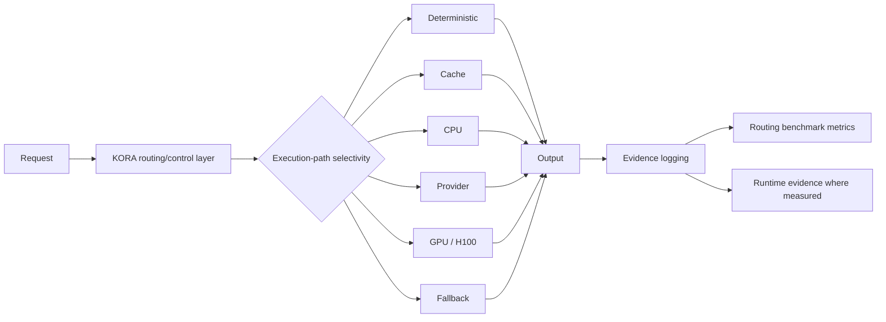

# Draft Figure 1: KORA Execution-Path Selectivity Overview

Caption: KORA frames AI workload execution as execution-path selectivity. A request is routed by a control layer to deterministic, cache, CPU, provider, GPU, or fallback execution, and the route decision is logged for benchmark evidence review.

Claim boundary note: This figure is a conceptual figure draft. It explains the route taxonomy and evidence logging flow; it is not a runtime result and does not imply deployed outcomes.

Source evidence:

- `docs/reports/kora-champion-gpu-004a-routing-benchmark-framework-report.md`
- `docs/reports/kora-studio-launch-evidence-plan.md`
- `docs/reports/kora-early-paper-outline.md`
